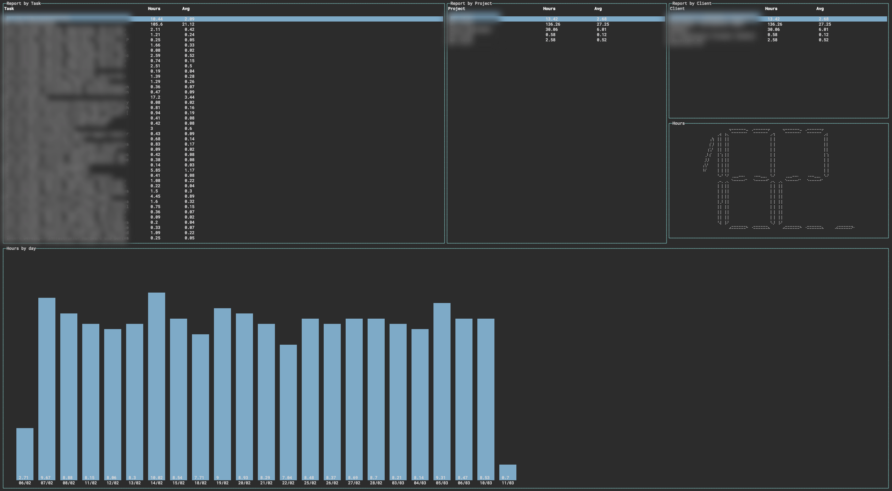

## Required Env Vars

HARVEST_ACCESS_TOKEN

HARVEST_ACCOUNT_ID

Commands

`--from 2019-01-01`

`--from 2019-01-01 --to 2019-02-01`
 

`--from 2019-01-01 --to 2019-02-01 --ignore CLIENT_ID_1,CLIENT_ID_2...`
